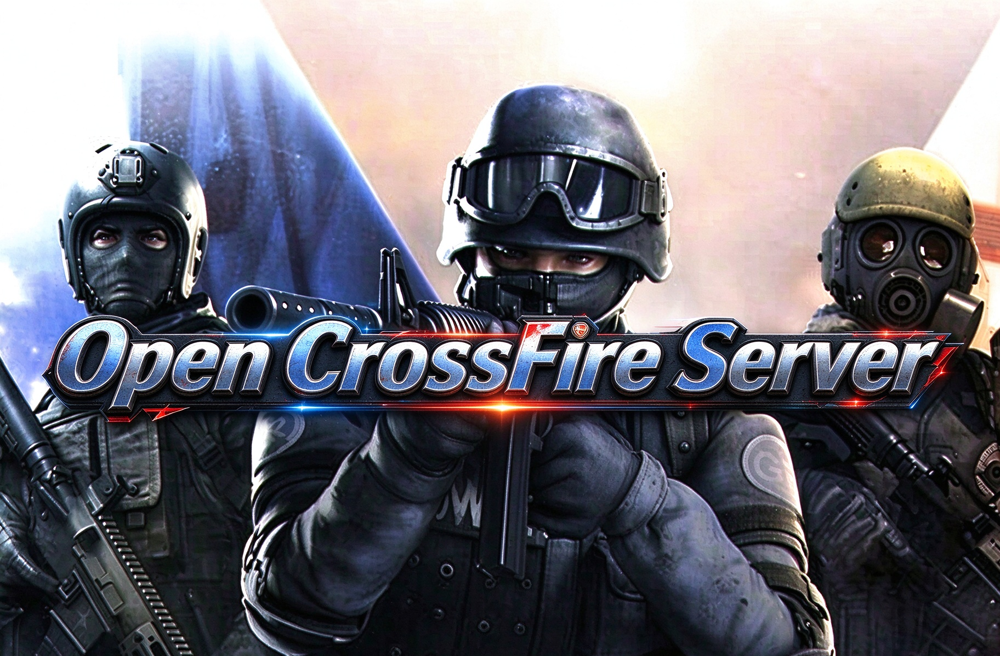

<a id="readme-top"></a>


<!-- PROJECT LOGO -->
<br />
<div align="center">
  <a href="https://github.com/github_username/repo_name">
    
  </a>

<h3 align="center">Open Crossfire Server</h3>

  <p align="center">
    Based on modifications to the IPGra server source code, the goal is to maximize compatibility with version 1.0 clients and overcome certain limitations of the leaked original server software.
    <br />
    <br />
    <!-- <a href="https://github.com/github_username/repo_name">View Demo</a>
    &middot;
    <a href="https://github.com/2601677867/open_crossfire_server/issues/new?labels=bug&template=bug-report---.md">Report Bug</a>
    &middot;
    <a href="https://github.com/2601677867/open_crossfire_server/issues/new?labels=enhancement&template=feature-request---.md">Request Feature</a> -->
  </p>
</div>


[![Stargazers][stars-shield]][stars-url] [![Issues][issues-shield]][issues-url] [![project_license][license-shield]][license-url]


<!-- ABOUT THE PROJECT -->
## About The Project


The leaked server files for the Philippine version of CrossFire 1.0 consist solely of binaries and the database. Modifying the software via reverse engineering is extremely difficult; furthermore, the server is restricted to Windows Server and SQL Server environments and contains hard-coded configurations or rigid limitations—all of which pose critical obstacles for anyone wishing to explore this classic, entertaining FPS game.

The talented team at IPGra used C# to flawlessly emulate everything required by the 3.0 client and provided an ideal framework for rewriting the 1.0 server. Building upon the IPGra server foundation, this project implements a range of features, such as eliminating the dependency on SQL Server and restoring the original engine's plugin system.


### Built With

[](https://visualstudio.microsoft.com/)


<!-- GETTING STARTED -->
## Getting Started
 
These instructions get a local copy up and running. Everything here targets a **private, isolated lab
network** — this server stack has no relationship to any live/production service, and it ships no game
assets (see [Disclaimer](#-免责声明-legal-disclaimer)).
 
> You must supply your own legally-obtained game client. This repository contains **only** my own
> re-implementation code — no client, no binaries, no assets, no database scripts, no vendor config files.
 
### Prerequisites
 
* **Windows 10/11 (or Windows Server 2016+)** — every service uses Win32 APIs (`%WINDIR%\System32` ini
  paths, `PerformanceCounter`, Windows Service hosting), so this does not run on Linux without porting work.
* **.NET Framework 4.7.2** — runtime + targeting pack. Install via Visual Studio 2019/2022
  (".NET desktop development" workload), or:
  ```powershell
  winget install Microsoft.DotNet.Framework.DeveloperTools-472
  ```
* **A database server with stored-procedure support** — the reference implementation targets
  Microsoft SQL Server (T-SQL `USP_*` procedures, called through the DB gateway). MySQL/MariaDB also
  works if you port the DB gateway backend; see [Database](#database).
* **MSBuild** (comes with Visual Studio) — there is no `dotnet build` path, these are legacy
  non-SDK-style `.csproj` files.
* **`IPGRA_LIB_DIR` environment variable (required)** — every service resolves shared assemblies
  (`Commons`, `Network`, `DBGWManager`, `PMSConn`, `Security`) at runtime through
  `AppDomain.AssemblyResolve`:
 
  ```csharp
  var dir = Environment.GetEnvironmentVariable("IPGRA_LIB_DIR");
  return Assembly.LoadFrom(dir + "\\" + ass + ".dll");
  ```
 
  Set it to the folder you publish the built library DLLs into, **before** starting any service —
  otherwise the process dies during dependency resolution:
  ```powershell
  [Environment]::SetEnvironmentVariable("IPGRA_LIB_DIR", "C:\cf\libs", "Machine")
  ```
 
### Build
 
```sh
# from the repository root
msbuild xxx\xxx.sln /t:Restore /p:Configuration=Release /p:Platform="Any CPU"
msbuild gDBGW\gDBGW.sln      /t:Restore /p:Configuration=Release p:Platform="Any CPU"
```


<!-- ROADMAP -->
## Roadmap

- [ ] Feature 1
- [ ] Feature 2
- [ ] Feature 3
    - [ ] Nested Feature

See the [open issues](https://github.com/github_username/repo_name/issues) for a full list of proposed features (and known issues).


<!-- CONTRIBUTING -->
## Contributing

Contributions are what make the open source community such an amazing place to learn, inspire, and create. Any contributions you make are **greatly appreciated**.

If you have a suggestion that would make this better, please fork the repo and create a pull request. You can also simply open an issue with the tag "enhancement".
Don't forget to give the project a star! Thanks again!

1. Fork the Project
2. Create your Feature Branch (`git checkout -b feature/AmazingFeature`)
3. Commit your Changes (`git commit -m 'Add some AmazingFeature'`)
4. Push to the Branch (`git push origin feature/AmazingFeature`)
5. Open a Pull Request


### Top contributors:

<a href="https://github.com/github_username/repo_name/graphs/contributors">
  
</a>


<!-- LICENSE -->
## License

This repository is an **independent, educational re-implementation of a game-server wire protocol,
created for interoperability research and study only**. It is **not** affiliated with, authorized,
sponsored, or endorsed by the developer of CrossFire or by any publisher/operator in any region.
 
This project **does not contain, link to, or distribute** any third-party copyrighted material —
including the game client, executables or DLLs, art/audio assets (`.rez`, `.ltc`, `.msz`), server
binaries, database scripts, configuration files, or any leaked/non-public source code. Users must
obtain those materials through their own lawful means. All trademarks and product names belong to
their respective owners and are referenced here only to identify the research target.
 
**No commercial use.** Do not operate, host, monetize, bundle, or resell this software. Do not use it
to circumvent anti-cheat mechanisms or to interfere with any live/production service. Offline,
self-hosted, isolated lab environments only. The software is provided **AS IS**, without warranty of
any kind; all risk lies with the user, and the authors accept no liability for any damages or legal
consequences. Reverse-engineering legality varies by jurisdiction — verify your local laws first.
Rights holders may contact [email/issue] and the material in question will be removed promptly.

<!-- CONTACT -->
## Contact

Kevin Anderson - kevinanderson@outlook.com


<!-- MARKDOWN LINKS & IMAGES -->
<!-- https://www.markdownguide.org/basic-syntax/#reference-style-links -->
[contributors-shield]: https://img.shields.io/github/contributors/github_username/repo_name.svg?style=for-the-badge
[contributors-url]: https://github.com/github_username/repo_name/graphs/contributors
[forks-shield]: https://img.shields.io/github/forks/github_username/repo_name.svg?style=for-the-badge
[forks-url]: https://github.com/github_username/repo_name/network/members
[stars-shield]: https://img.shields.io/github/stars/github_username/repo_name.svg?style=for-the-badge
[stars-url]: https://github.com/github_username/repo_name/stargazers
[issues-shield]: https://img.shields.io/github/issues/github_username/repo_name.svg?style=for-the-badge
[issues-url]: https://github.com/github_username/repo_name/issues
[license-shield]: https://img.shields.io/github/license/github_username/repo_name.svg?style=for-the-badge
[license-url]: https://github.com/github_username/repo_name/blob/master/LICENSE.txt
[linkedin-shield]: https://img.shields.io/badge/-LinkedIn-black.svg?style=for-the-badge&logo=linkedin&colorB=555
[linkedin-url]: https://linkedin.com/in/linkedin_username
[product-screenshot]: images/screenshot.png
<!-- Shields.io badges. You can a comprehensive list with many more badges at: https://github.com/inttter/md-badges -->
[Next.js]: https://img.shields.io/badge/next.js-000000?style=for-the-badge&logo=nextdotjs&logoColor=white
[Next-url]: https://nextjs.org/
[React.js]: https://img.shields.io/badge/React-20232A?style=for-the-badge&logo=react&logoColor=61DAFB
[React-url]: https://reactjs.org/

[Vue.js]: https://img.shields.io/badge/Vue.js-35495E?style=for-the-badge&logo=vuedotjs&logoColor=4FC08D
[Vue-url]: https://vuejs.org/
[Angular.io]: https://img.shields.io/badge/Angular-DD0031?style=for-the-badge&logo=angular&logoColor=white
[Angular-url]: https://angular.io/
[Svelte.dev]: https://img.shields.io/badge/Svelte-4A4A55?style=for-the-badge&logo=svelte&logoColor=FF3E00
[Svelte-url]: https://svelte.dev/
[Laravel.com]: https://img.shields.io/badge/Laravel-FF2D20?style=for-the-badge&logo=laravel&logoColor=white
[Laravel-url]: https://laravel.com
[Bootstrap.com]: https://img.shields.io/badge/Bootstrap-563D7C?style=for-the-badge&logo=bootstrap&logoColor=white
[Bootstrap-url]: https://getbootstrap.com
[JQuery.com]: https://img.shields.io/badge/jQuery-0769AD?style=for-the-badge&logo=jquery&logoColor=white
[JQuery-url]: https://jquery.com 